#   Project workflows

I used mermaid diagrams to explain the workflow I used for each action. First take a look at the state diagram beacause the next diagrams may make reference to that one in order to be more clear and separate workflows.

### 🗺️ States

In the next diagram you can see the states in which the user can move between

---

### 👤 Auth

There are two diagrams, one for register process and one for login. Although both processes end up having the same information about the user each one have a different flow to reach it. 

```mermaid
---
config:
  theme: redux
  layout: elk
---

flowchart TD
  %% -------------------- REGISTER --------------------
  subgraph s1["Register"]
    A(["Register"]) --> B["Client & Server validations"]
    B --> E["Generate Salt, RSA Keypair, TOTP key"]
    E --> F["Hash PWD (Argon2 + Salt)"]

    F -- "1st 128 bits" --> G["Gen AES key"]
    F -- "2nd 128 bits" --> K["Create User"]

    G --> H["Encrypt TOTP Key (AES)"] & J["Encrypt Private RSA Key (AES)"]

    E -- "Salt + Public RSA key" --> K
    H --> K
    J --> K
    K --o L["Database"]

    B@{shape: hex}
    K@{shape: display}
    L@{shape: db}
  end

  %% -------------------- LOGIN --------------------
  subgraph s2["Login"]
    A1(["Login"]) --> B1["Client & Server validations"]
    B1 --> K1["Fetch Salt"]
    K1 --> C1["Hash PW (Argon2 + Salt)"]

    
    C1 -- "1st 128 bits" --> D1["Gen AES key"]

    D1 --> E1["Decrypt TOTP key"] & M1
    E1 --> F1["Verify 2FA code"]

    F1 --> H1["Decrypt Private RSA key"]
    H1 --> M1["Logged User"]

    L1["Database"]
    L1 --o K1
    L1 -- "Enc. TOTP Key" --o E1
    L1 -- "Enc. priv Key" --o H1
    L1 -- "Public RSA Key" --o M1
    L1 -- "Compare" --o C1

    B1@{shape: hex}
    M1@{shape: display}
    L1@{shape: db}
  end
```

---
## 🎯 Actions

The actions seen in the diagram are upload, download and send files. In the diagram send the nodes `Encrypt File` and `Decrypt File` make references to the actions upload and download files.

